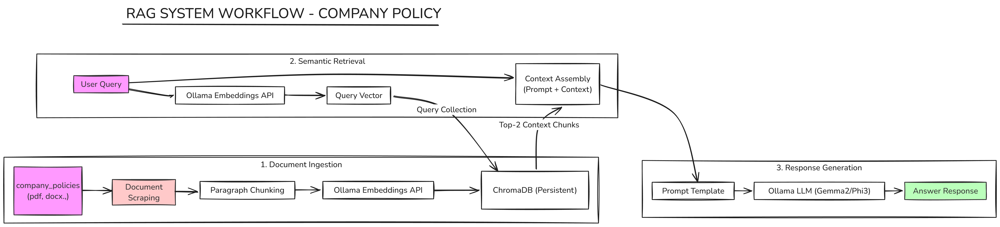

# Assignment-3: RAG System Architecture & Workflow Blueprint

## Objective & Overview
The objective of this assignment is to design and document a comprehensive **Retrieval-Augmented Generation (RAG)** pipeline. This architectural blueprint acts as the conceptual map for the interactive policy search engine built in Assignment-4. By analyzing the flow of documents from raw files to embedded vectors, and tracing user queries to context-rich LLM answers, we ensure a clean separation of concerns and robust data flow.

---

## RAG Workflow Overview Diagram
The directory contains two architecture files representing the workflow:

---

## Detailed RAG Pipeline Workflow Explanation

A standard RAG pipeline is divided into three core stages: **Ingestion**, **Retrieval**, and **Synthesis/Generation**.

### Phase 1: Document Ingestion Pipeline (Offline/Pre-processing)

1. **Document Ingestion & File Upload**:
   Users upload document files (.pdf, .txt, .docx) via the application frontend.
2. **Parsing Layer**:
   * **Text Files**: Parsed block-by-block using custom line splits.
   * **PDF Files**: Parsed page-by-page to preserve layout structures.
   * **Word Documents (.docx)**: Parsed paragraph-by-paragraph.
3. **Semantic Chunking**:
   Text is broken into semantic chunks to ensure that each chunk fits inside the embedding model's context window while preserving relevant content. Associated metadata (source file, exact location index) is attached to each chunk.
4. **Vector Embedding Generation**:
   Each chunk is passed to the local Ollama embedding engine utilizing the `tinyllama:latest` model, generating a high-dimensional vector representation.
5. **Persistent Vector Store (ChromaDB)**:
   The embeddings, raw text chunks, and metadata are saved to the persistent vector database (`chroma_db/`).

---

### Phase 2: Query & Retrieval Pipeline (Online/Real-time)

1. **Query Input**:
   The user types a policy question (e.g., *"What is the remote work stipend limit?"*) in the frontend.
2. **Query Vectorization**:
   The user's query is converted into a vector representation using the same local embedding model (`tinyllama:latest`) to align it with the document database coordinate system.
3. **Vector Similarity Search**:
   ChromaDB performs a vector search (using cosine similarity or L2 distance) comparing the query vector against the indexed document vectors.
4. **Top-K Chunk Selection**:
   The database returns the top `K` (configured to `n_results=2`) chunks with the highest similarity scores, along with their metadata.

---

### Phase 3: Response Synthesis & Citation Generation (Online/Real-time)

1. **Prompt Engineering & Context Injection**:
   The retrieved document chunks are concatenated as a flat text block (context). A system prompt is constructed combining:
   * **Role**: Expert HR Assistant.
   * **Groundedness**: Must answer *strictly* using the provided context. If the answer isn't present, return a default refusal.
   * **Formatting Constraints**: Absolute ban on markdown italics (`*` or `_`) to ensure compatibility; output must be clean plain text.
   * **Context Block**: Injected retrieved text.
   * **Query**: The user's original query.
2. **LLM Reasoning (Groq Cloud)**:
   The engineered prompt is sent to the cloud inference engine (`llama-3.1-8b-instant` via Groq) using the OpenAI compatible endpoint. Using a fast, high-parameter model ensures accurate reading comprehension and reasoning.
3. **Citation & Answer Rendering**:
   The application displays:
   * The clean plain text response from the LLM.
   * Distinct, clickable visual badges for each source cited (extracted from chunk metadata) to guarantee verifiable, hallucination-free answers.
