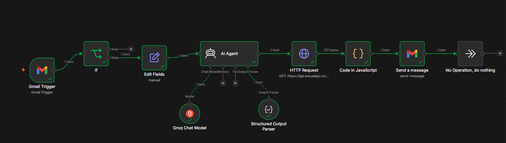

# Assignment 2: Smart Gmail Agent with n8n

An intelligent email automation agent built in **n8n** that classifies incoming support and admin emails using LLMs (Groq), retrieves department contacts from an external REST API, filters the relevant recipients, and sends targeted escalation alerts.

---

## Demo Video & Workflow Screenshot

[](https://drive.google.com/file/d/1b9RWrsGwaflTKZyXSxyl5T-5Px4_2Xp2/view?usp=sharing)

*If the button above does not work, you can access the video directly via the [Google Drive Video Link](https://drive.google.com/file/d/1b9RWrsGwaflTKZyXSxyl5T-5Px4_2Xp2/view?usp=sharing).*

### Workflow Canvas Screenshot


---

## Step-by-Step Agentic Workflow Explanation

The workflow executes the following end-to-end steps to route emails intelligently:

### 1. Gmail Trigger
*   **Purpose:** Listens continuously for new incoming emails in your inbox.
*   **Output:** Extracts raw, unstructured fields such as the sender's address (`sender`), `subject`, `body`, and message metadata.

### 2. Spam & Automated Filter (IF Node)
*   **Purpose:** Automatically filters out noise (newsletters, spam, or automated system notifications).
*   **Logic:** Checks if the sender address contains `noreply`. If yes, the workflow terminates immediately. If not, the email is marked as a valid human query and proceeds.

### 3. Context Consolidation (Set Node)
*   **Purpose:** Prepares the email content for the LLM.
*   **Logic:** Merges the `subject` and `body` fields into a single unified parameter called `query`. This provides the AI with clean, aggregated text to analyze rather than fragmented fields.

### 4. LLM Category Decision (AI Agent Node)
*   **Model:** Initialized via **Groq** using a fast, high-performance model.
*   **Structured Parser Schema:** Enforces the output to match a strict JSON object:
    ```json
    {
      "category": "customer or admin"
    }
    ```
*   **Logic:** The AI processes the consolidated email `query`. It assigns it to the `"customer"` category if it relates to pricing, feedback, or general inquiries, or the `"admin"` category if it relates to server bugs, credentials, or internal issues.

### 5. Fetch Team Database (HTTP Request Node)
*   **Purpose:** Retrieves the list of available team members.
*   **Endpoint:** `GET https://api.escuelajs.co/api/v1/users`
*   **Output:** Returns a JSON list of users with attributes like `name`, `email`, and `role` (e.g. `customer`, `admin`).

### 6. Team Filter & De-duplication (Code Node)
*   **Purpose:** Dynamically identifies the exact users who should handle the ticket, formatting the results for a single email send.
*   **Logic:**
    1. Reads the categorized department (`customer` or `admin`) from the AI Agent node using `.first()`.
    2. Capitalizes the category's first letter (e.g., `Customer` or `Admin`) for email presentation.
    3. Filters the API's user list to match that department role.
    4. De-duplicates contacts to ensure no email address receives the message twice.
    5. Limits the list to a maximum of **5 unique users**.
    6. Combines the emails into a single comma-separated string (e.g., `john@mail.com, sarah@mail.com`).

### 7. Consolidated Email Dispatch (Gmail Send Node)
*   **Purpose:** Notifies the designated department team in one email.
*   **To:** `{{ $json.emails }}`
*   **Subject:** `Escalated Ticket [{{ $json.category.toUpperCase() }}]: {{ $('Gmail Trigger').first().json.subject }}`
*   **Email Body:**
    ```text
    Dear {{ $json.category }} Team,

    A new email query has been escalated to your department:

    Sender: {{ $('Gmail Trigger').first().json.sender }}
    Message: {{ $('Set').first().json.query }}

    Please take action accordingly.
    ```
